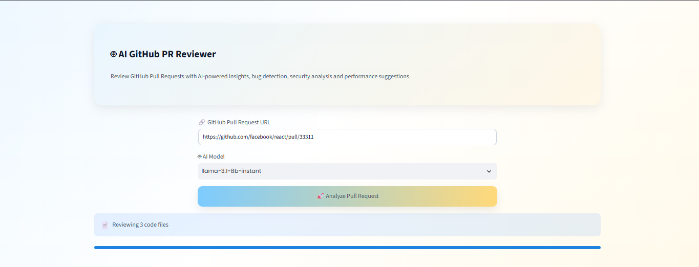
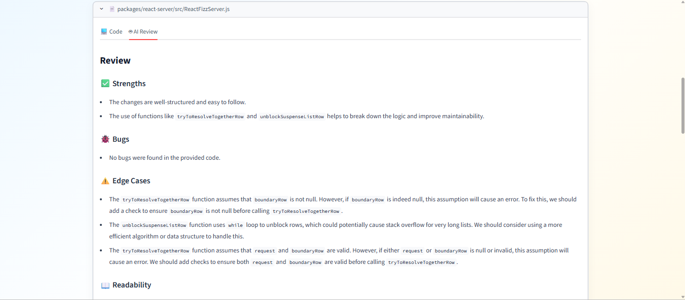
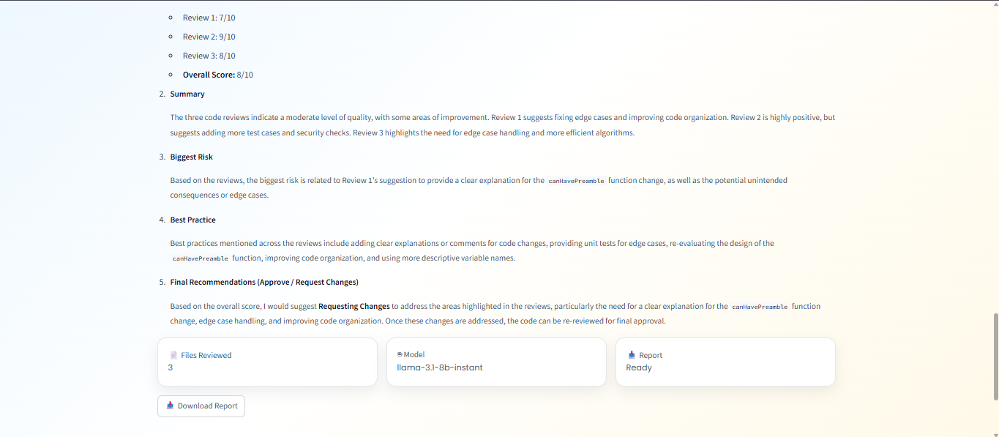

# 🤖 AI GitHub PR Reviewer

An AI-powered GitHub Pull Request Reviewer built using **Python**, **Streamlit**, **Groq LLM**, and the **GitHub REST API**. It automatically analyzes pull requests and generates detailed code reviews, highlighting code quality, potential bugs, security concerns, performance improvements, and an overall summary.

---

## 🚀 Features

- 🔍 Analyze any public GitHub Pull Request
- 🤖 AI-powered code review using Groq LLMs
- 🐞 Detect potential bugs and issues
- 🔒 Identify possible security concerns
- ⚡ Suggest performance improvements
- 📝 Generate an overall PR summary
- 📥 Download the review as a Markdown report
- 🎨 Clean and responsive Streamlit interface

---

## 📸 Screenshots

### Home Page

> Add a screenshot here



### AI Review

> Add a screenshot here



### Overall Summary

> Add a screenshot here



---

## 🛠️ Tech Stack

- Python
- Streamlit
- Groq API
- GitHub REST API
- python-dotenv

---

## 📂 Project Structure

```text
github-pr-review-agent/
│
├── app.py
├── ai_reviewer.py
├── github_api.py
├── utils.py
├── styles.py
├── requirements.txt
├── README.md
├── .env.example
├── .gitignore
└── assets/
```

---

## ⚙️ Installation

Clone the repository:

```bash
git clone https://github.com/mohan30233/github-pr-review-agent.git
```

Move into the project:

```bash
cd github-pr-review-agent
```

Install the required packages:

```bash
pip install -r requirements.txt
```

Create a `.env` file:

```env
GROQ_API_KEY=your_groq_api_key
GITHUB_TOKEN=your_github_token
```

Run the application:

```bash
streamlit run app.py
```

---

## 📖 How to Use

1. Open the Streamlit application.
2. Paste a GitHub Pull Request URL.
3. Choose an AI model.
4. Click **Analyze Pull Request**.
5. View file-by-file AI reviews.
6. Read the overall PR summary.
7. Download the report in Markdown format.

---

## 🎯 Future Improvements

- Support OpenAI and Gemini models
- Generate PDF reports
- Comment directly on GitHub Pull Requests
- User authentication
- Review private repositories
- Docker support
- GitHub Actions integration

---

## 👨‍💻 Author

**Mohan Krishna**

GitHub: https://github.com/mohan30233

---

## ⭐ If you found this project useful, consider giving it a star!